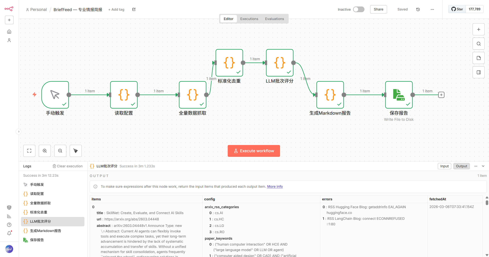
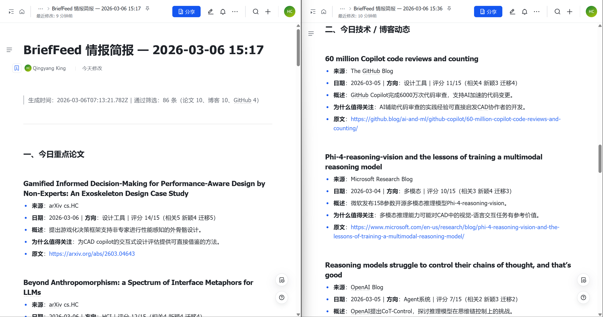

# BriefFeed

基于 n8n 本地工作流的每日研究情报简报工具。点击运行，1–3 分钟内自动从 arXiv、GitHub Trending 和自定义 RSS 源抓取内容，经 LLM 按你的研究兴趣打分筛选，生成结构化 Markdown 报告。

> **定位**：本地运行，数据不上传，按用户研究方向定制，适合需要每天跟踪特定领域动态的研究者或工程师。

---

## 运行效果

### 工作流架构（n8n 界面）




### 报告输出示例




---

## 工作原理

```
手动触发（点击 Execute Workflow）
  → 全量数据抓取     arXiv RSS + arXiv API + RSS 博客 + GitHub（全部并发）
  → 标准化去重       URL 去重、新鲜度过滤（fresh_days）
  → LLM 批次评分     分批并发调用 DeepSeek-V3，按研究兴趣打分 + 生成中文摘要
  → 生成 Markdown    三板块结构，按分值排序
  → 保存报告         写入 output/briefeed_YYYYMMDD_HHmm.md
```

每次运行耗时约 **1–3 分钟**，取决于数据量和 API 响应速度。

---

## 报告格式

```markdown
# BriefFeed 情报简报 — 2026-03-06 15:36

> 生成时间：... | 通过筛选：89 条（论文 10、博客 10、GitHub 4）

## 一、今日重点论文
### 论文标题
- 来源 / 日期 / 方向 / 评分（如 15/15）
- 概述（中文摘要）
- 为什么值得关注
- 原文链接

## 二、今日技术 / 博客动态
## 三、今日 GitHub / 开源项目
```

---

## 快速开始

### 依赖

- [Docker Desktop](https://www.docker.com/products/docker-desktop/)
- 硅基流动 API Key（免费注册）：https://cloud.siliconflow.cn/account/ak

### 第一步：初始化配置文件

```powershell
cd D:\code\BriefFeed

cp .env.template .env
cp config/settings.template.json config/settings.json
cp config/rss_sources.template.json config/rss_sources.json
cp config/researcher_profile.template.md config/researcher_profile.md
```

### 第二步：填入密钥（`.env`）

```env
SILICONFLOW_API_KEY=sk-xxxxxxxxxxxxxxxx   # 必须
GITHUB_TOKEN=ghp_xxxxxxxxxxxxxxxx         # 可选，提升 GitHub 速率限额
```

GitHub Token 申请（只需 `public_repo` 只读权限）：https://github.com/settings/tokens

### 第三步：个性化配置

| 文件 | 作用 |
|------|------|
| `config/researcher_profile.md` | 描述你的研究方向，作为 LLM System Prompt，直接影响筛选质量 |
| `config/settings.json` | arXiv 分类、论文关键词、GitHub 搜索词 |
| `config/rss_sources.json` | RSS 源列表，可按需启用/禁用 |

> 这三个文件是 BriefFeed 个性化的核心，模板中均有详细注释说明。

### 第四步：启动 n8n

```powershell
docker compose up -d
```

n8n 在 **http://localhost:5679** 启动。

### 第五步：导入工作流

1. 打开 http://localhost:5679，注册/登录
2. **Workflows → Add Workflow → ··· → Import from File**
3. 选择 `workflows/briefeed_main.json`

### 运行

打开 n8n → 找到 **BriefFeed — 专业情报简报** → 点击 **Execute Workflow**

报告保存在：

```
output/briefeed_YYYYMMDD_HHmm.md
```

---

## 项目结构

```
BriefFeed/
├── .env.template                          # 密钥模板（复制为 .env 后填写）
├── docker-compose.yml                     # n8n 容器配置
├── workflows/
│   └── briefeed_main.json                 # n8n 工作流（直接导入）
├── config/
│   ├── settings.template.json             # 参数配置模板
│   ├── rss_sources.template.json          # RSS 源模板
│   └── researcher_profile.template.md     # 研究兴趣模板
├── docs/                                  # 文档截图
│   ├── workflow_architecture.png
│   └── output_sample.png
└── output/                                # 报告输出目录（运行时自动生成）
```

> **⚠️ 隐私说明**：`.env` / `config/settings.json` / `config/rss_sources.json` / `config/researcher_profile.md` 含个人信息，已被 `.gitignore` 排除，不会上传到 Git。

---

## 配置参数参考

所有运行时配置在工作流第 2 个节点 **【全量数据抓取】** 的 `CONFIG` 对象中，双击节点即可编辑：

| 配置项 | 说明 | 默认值 |
|--------|------|--------|
| `arxiv_rss_categories` | arXiv RSS 订阅分类 | `[cs.AI, cs.HC, cs.LG, cs.RO]` |
| `paper_keywords` | arXiv API 关键词（支持 AND/OR） | 见工作流 |
| `github_keywords` | GitHub 搜索关键词 | 见工作流 |
| `rss_sources` | RSS 源列表，`enabled:false` 可关闭 | 见工作流 |
| `fresh_days` | 只保留最近 N 天内容（0 = 不过滤） | `7` |
| `rss_items_per_source` | 每个 RSS 源最多取几条 | `10` |
| `arxiv_results_per_kw` | 每个关键词最多取几篇论文 | `8` |
| `github_results_per_kw` | 每个关键词最多取几个仓库 | `10` |
| `llm_batch_size` | 每批提交给 LLM 的条目数 | `20` |
| `llm_max_concurrency` | LLM 批次最大并发数 | `3` |
| `llm_model` | LLM 模型 | `deepseek-ai/DeepSeek-V3` |
| `scoring_weights` | 相关性/新颖性/实用性 权重 | `0.5/0.3/0.2` |
| `max_items_per_section` | 每板块最多输出条目数 | `10` |

---

## 常见问题

**Q: 提示 `SILICONFLOW_API_KEY` 未配置**  
A: 检查 `.env` 是否已正确填写，`docker compose up -d` 重启后再试。

**Q: GitHub 搜索返回 `rate limit` 错误**  
A: 在 `.env` 中配置 `GITHUB_TOKEN`，速率限额从 10 次/分钟提升至 30 次/分钟。

**Q: 某个 RSS 源一直报错**  
A: 在工作流 `CONFIG.rss_sources` 中将该源 `enabled` 设为 `false`。

**Q: 想换用更强的 LLM**  
A: 将 `CONFIG.llm_model` 改为 `deepseek-ai/DeepSeek-R1`（推理更强，速度较慢）。

**Q: 想加快 LLM 处理速度**  
A: 调大 `llm_max_concurrency`（如 5），但需注意 API 并发限制；或调小 `llm_batch_size` 减少单批超时风险。

**Q: Cannot find module 'https'**  
A: 检查 `docker-compose.yml` 中是否有 `NODE_FUNCTION_ALLOW_BUILTIN=https,http,url,buffer,stream`，重启容器。

